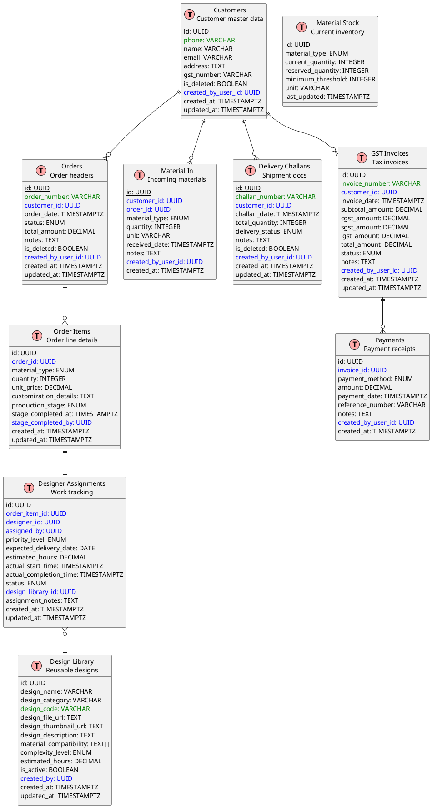

# PlantUML Database Schema Diagram

```plantuml
@startuml
!define Table(name,desc) class name as "desc" << (T,#FFAAAA) >>
!define primary_key(x) <u>x</u>
!define foreign_key(x) <color:blue>x</color>
!define unique(x) <color:green>x</color>

Table(customers, "Customers\nCustomer master data") {
    primary_key(id: UUID)
    unique(phone: VARCHAR)
    name: VARCHAR
    email: VARCHAR
    address: TEXT
    gst_number: VARCHAR
    is_deleted: BOOLEAN
    foreign_key(created_by_user_id: UUID)
    created_at: TIMESTAMPTZ
    updated_at: TIMESTAMPTZ
}

Table(orders, "Orders\nOrder headers") {
    primary_key(id: UUID)
    unique(order_number: VARCHAR)
    foreign_key(customer_id: UUID)
    order_date: TIMESTAMPTZ
    status: ENUM
    total_amount: DECIMAL
    notes: TEXT
    is_deleted: BOOLEAN
    foreign_key(created_by_user_id: UUID)
    created_at: TIMESTAMPTZ
    updated_at: TIMESTAMPTZ
}

Table(order_items, "Order Items\nOrder line details") {
    primary_key(id: UUID)
    foreign_key(order_id: UUID)
    material_type: ENUM
    quantity: INTEGER
    unit_price: DECIMAL
    customization_details: TEXT
    production_stage: ENUM
    stage_completed_at: TIMESTAMPTZ
    foreign_key(stage_completed_by: UUID)
    created_at: TIMESTAMPTZ
    updated_at: TIMESTAMPTZ
}

Table(designer_assignments, "Designer Assignments\nWork tracking") {
    primary_key(id: UUID)
    foreign_key(order_item_id: UUID)
    foreign_key(designer_id: UUID)
    foreign_key(assigned_by: UUID)
    priority_level: ENUM
    expected_delivery_date: DATE
    estimated_hours: DECIMAL
    actual_start_time: TIMESTAMPTZ
    actual_completion_time: TIMESTAMPTZ
    status: ENUM
    foreign_key(design_library_id: UUID)
    assignment_notes: TEXT
    created_at: TIMESTAMPTZ
    updated_at: TIMESTAMPTZ
}

Table(design_library, "Design Library\nReusable designs") {
    primary_key(id: UUID)
    design_name: VARCHAR
    design_category: VARCHAR
    unique(design_code: VARCHAR)
    design_file_url: TEXT
    design_thumbnail_url: TEXT
    design_description: TEXT
    material_compatibility: TEXT[]
    complexity_level: ENUM
    estimated_hours: DECIMAL
    is_active: BOOLEAN
    foreign_key(created_by: UUID)
    created_at: TIMESTAMPTZ
    updated_at: TIMESTAMPTZ
}

Table(material_in, "Material In\nIncoming materials") {
    primary_key(id: UUID)
    foreign_key(customer_id: UUID)
    foreign_key(order_id: UUID)
    material_type: ENUM
    quantity: INTEGER
    unit: VARCHAR
    received_date: TIMESTAMPTZ
    notes: TEXT
    foreign_key(created_by_user_id: UUID)
    created_at: TIMESTAMPTZ
}

Table(material_stock, "Material Stock\nCurrent inventory") {
    primary_key(id: UUID)
    material_type: ENUM
    current_quantity: INTEGER
    reserved_quantity: INTEGER
    minimum_threshold: INTEGER
    unit: VARCHAR
    last_updated: TIMESTAMPTZ
}

Table(delivery_challans, "Delivery Challans\nShipment docs") {
    primary_key(id: UUID)
    unique(challan_number: VARCHAR)
    foreign_key(customer_id: UUID)
    challan_date: TIMESTAMPTZ
    total_quantity: INTEGER
    delivery_status: ENUM
    notes: TEXT
    is_deleted: BOOLEAN
    foreign_key(created_by_user_id: UUID)
    created_at: TIMESTAMPTZ
    updated_at: TIMESTAMPTZ
}

Table(gst_invoices, "GST Invoices\nTax invoices") {
    primary_key(id: UUID)
    unique(invoice_number: VARCHAR)
    foreign_key(customer_id: UUID)
    invoice_date: TIMESTAMPTZ
    subtotal_amount: DECIMAL
    cgst_amount: DECIMAL
    sgst_amount: DECIMAL
    igst_amount: DECIMAL
    total_amount: DECIMAL
    status: ENUM
    notes: TEXT
    foreign_key(created_by_user_id: UUID)
    created_at: TIMESTAMPTZ
    updated_at: TIMESTAMPTZ
}

Table(payments, "Payments\nPayment receipts") {
    primary_key(id: UUID)
    foreign_key(invoice_id: UUID)
    payment_method: ENUM
    amount: DECIMAL
    payment_date: TIMESTAMPTZ
    reference_number: VARCHAR
    notes: TEXT
    foreign_key(created_by_user_id: UUID)
    created_at: TIMESTAMPTZ
}

' Relationships
customers ||--o{ orders
orders ||--o{ order_items
order_items ||--|| designer_assignments
designer_assignments }o--|| design_library
customers ||--o{ material_in
customers ||--o{ delivery_challans
customers ||--o{ gst_invoices
gst_invoices ||--o{ payments

@enduml
```
